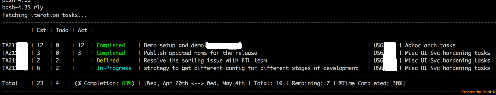

# rally-cli


## Intro
  * Provides a basic CLI based on Node.js
  * Not a full fledged client by any means
  * Does basic things like view iteration tasks, updating todos etc.
  * Works only with one project at a time
  * This is how the interface looks like:


## Usage
  * Install Node.js (tested with v5.0.0, but might work with older versions as well)
  * Clone the repo and run npm install to install the dependencies
  * Modify the `config.js` file
 
```
{
  "apiKey": "qweqweqwe",  // API keys can be created/managed here: https://rally1.rallydev.com/login/accounts/index.html#/keys
  "currentItr": "PI 2 - Iteration 5", //Name of the Iteration
  "project": "/project/47117499999", //Available in rally URL: https://rally1.rallydev.com/#/47117499999ud/iterationstatus
  "user": "jdoe@acme.com", //Your email id 
  "uiLaunchCommand": "open -a Firefox https://rally1.rallydev.com/#/47117499999ud/custom/47826099999" //OS command to run to launch Rally in browser
}
```
  * Create an alias to the node command to launch the cli and add it to .bashrc or equivalent file
  
```
alias rly="node /location/of/index.js"
```
  * Launch the help options from CLI:
  
```  
bash-4.3$ rly help
Usage: rly [ <command> ] [<args>]

Minimal CLI for rally

Available commands:
  it | iteration # View and change current iteration
  t  | task      # View and edit tasks
  o  | open      # Open rally in browser
  d  | holidays  # Open rally in browser
  
```
